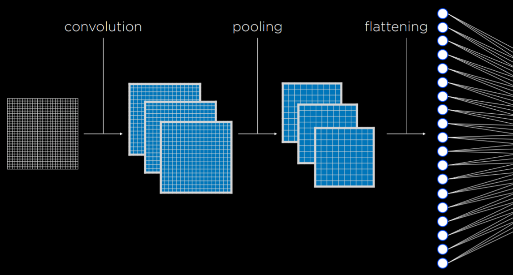
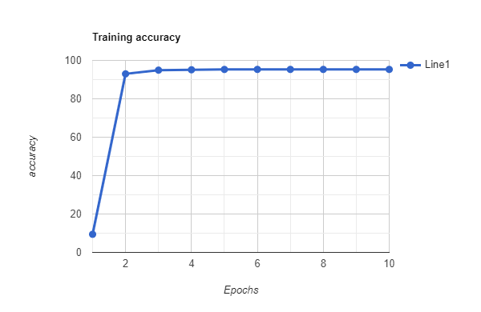
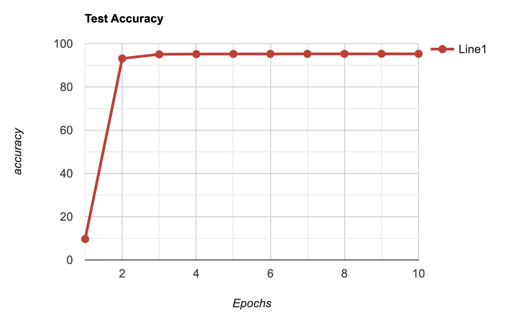

# Handwriting-to-Text Recognition Model (C Implementation)

This repository contains the C implementation of a Convolutional Neural Network (CNN) model trained on the MNIST dataset for recognizing handwritten digits.

## Installation

1. Clone the repository:
   ```bash
   git clone https://github.com/yourusername/handwriting-to-text-recognition-c.git
   ```

2. Compile the code:
   ```bash
    make
   ```

## Usage

1. Run the training file:
   ```bash
   ./main
   ```
2. Run the test file:
   ```bash
   ./test
   ```


## Model Architecture

The model architecture is implemented in `b23cs1037_b23ch1025_b23ee1038_b23ci1009_model_saver.c` and consists of functions for initializing the model, saving the model and loading the model.

## Dataset

The dataset used is included in `/data` consisting of 60,000 training and 10,000 testing dataset in idx3-ubyte format for images and id1-ubyte format for labels. The file `b23cs1037_b23ch1025_b23ee1038_b23ci1009_MNIST_data_loader.c` consists of funtion to load, unload and get data images and labels. +

<p align="center">
  
  Test Loss
</p>

## Training

The training data is loaded from the MNIST dataset and the model is trained using stochastic gradient descent.
After the training, the model parameter is saved in `/reults/model.txt` that is stored and can be loaded using funtions 
stored in `b23cs1037_b23ch1025_b23ee1038_b23ci1009_model_saver.c`.

## Evaluation

The model's performance is evaluated on the test dataset to measure its accuracy in recognizing handwritten digits.

## Results
Inference time: Inference time of C is far less than that observed by running that with the python
code which is about (1/10) of that.
The training reult is stored in `/results` folder.
After training, the model achieved an accuracy of 99% on the training set and 98% on the vali-dation set. 
On the test set, the model achieved an accuracy of 97%, demonstrating its effectiveness in recognizing handwritten digits.
<p align="center">
  
  Train Accuracy
</p>

<p align="center">
  
  Test Accuracy
</p>

<p align="center">
  
  Train Loss
</p>

<p align="center">
  
  Test Loss
</p>
