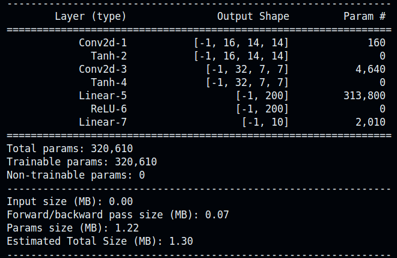

# **Handwriting-to-Text Recognition Model**
## **Implementation in C**

This repository contains the C implementation of a Convolutional Neural Network (CNN) model trained on the MNIST dataset for recognizing handwritten digits.

## **Installation**

1. Clone the repository:
   ```bash
   git clone https://github.com/yourusername/handwriting-to-text-recognition-c.git
   ```

2. Compile the code:
   ```bash
   make
   ```

## **Usage**

1. Run the training file:
   ```bash
   ./main
   ```
2. Enter the repository:
    ```bash
    cd CNN-in-C
    ```

3. Run the test file:
   ```bash
   ./test
   ```

## **Model Architecture**

The model architecture is implemented in `model_saver.c` and consists of functions for initializing the model, saving the model, and loading the model. 

<p align="center">
  
</p>
<p align="center"> CNN Model Architecture generated using PyTorch's `torchsummary`.</p>

## **Dataset**

The dataset used is included in `/data`, consisting of 60,000 training and 10,000 testing datasets in `idx3-ubyte` format for images and `idx1-ubyte` format for labels. The file `MNIST_data_loader.c` consists of functions to load, unload, and get data images and labels.

## **Training**

The training data is loaded from the MNIST dataset, and the model is trained using stochastic gradient descent (SGD). After training, the model parameters are saved in `/results/model.txt` and can be loaded using functions stored in `model_saver.c`.

## **Evaluation**

The model's performance is evaluated on the test dataset to measure its accuracy in recognizing handwritten digits.

## **Results**

### **Training Time and Accuracy**

| Implementation  | Training Time | Train Accuracy | Test Accuracy |
|------------------|---------------|----------------|---------------|
| C Implementation  | 44 minutes    | 98.61%         | 97.42%        |
| PyTorch          | 8 minutes 50 seconds | 99.49%         | 98.22%        |

### **Inference Time**
The inference time of the C implementation is significantly lower than that observed with the Python code, achieving about **1/10** of the inference time.

### **Graphs**
<p align="center">
  
</p>
<p align="center">Train Accuracy</p>

<p align="center">
  
</p>
<p align="center">Test Accuracy</p>

<p align="center">
  
</p>
<p align="center">Train Loss</p>

<p align="center">
  
</p>
<p align="center">Test Loss</p>

## **Conclusion**
This project demonstrates the efficiency and effectiveness of implementing a CNN in C from scratch. The C implementation offers competitive accuracy with a significant reduction in inference time compared to the Python (PyTorch) implementation, making it suitable for performance-sensitive applications.
